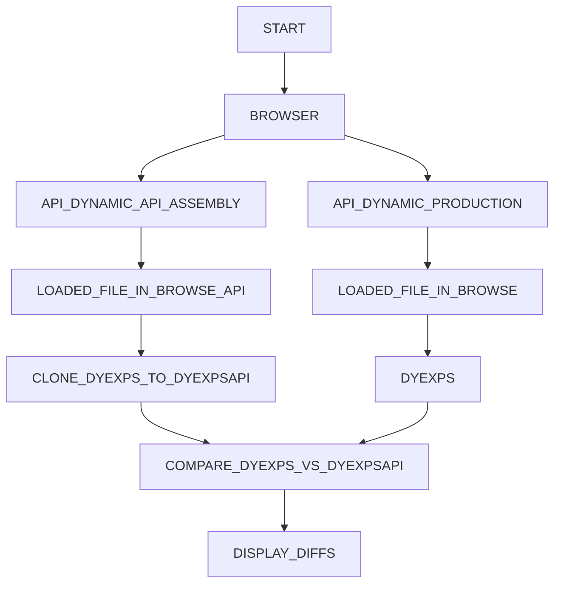

# Welcome to Api-ScriptLoader

> 🧑‍🚀 A project that help us to load dynamic files dynamically and compare them

## 🧞 Requirements

- NodeJS and NPM installed
- NodeJS version >= 16
- Install dependencies, run this command only one time
  - `npm install`

## 🚀 Project Structure

Inside of your this project, you'll see the following:

- UI that can load files dynamically
- CLI to compare two files, one created from api-assembly and the other from production

## FLOW

- Run cli command with section id/s, and optional flags
- Open headless browser using [playwright](https://playwright.dev/)
- Load `api_dynamic` file created by api-assembly
  - DYExps objects loaded
  - Clone DYExps object to DYExpsApi object
- Load `api_dynamic` file created by adm-server(ruby)
  - DYExps objects loaded
- Compare `DYExps` vs. `DYExpsApi` objects
- Display Results(Diffs)

## 🧞 USE

- Navigate to the root of the project, from a terminal and run the following command:  
  - `SECTION_ID=[<section id>] npx playwright test --project=chromium`
  - Where `section id` it's one or more sections
  - e.g:
    - SECTION_ID=[8781824] npx playwright test --project=chromium
    - SECTION_ID=[8781824,8781824,8781824] npx playwright test --project=chromium

## 🧞 FLAGS - OPTIONS

- `SECTION_ID` - mandatory
  - Array of section/s
  - e.g:
    - One Section: `SECTION_ID=[8781824] npx playwright test --project=chromium`
    - Multiple Section:`SECTION_ID=[8781824, 8781824] npx playwright test --project=chromium`

- `COMPARING_KEY` - optional
  - Default: `otags`
  - Key to compare, DYExps object contains the a list of elements, this is key that we will check
  - e.g.
    - `SECTION_ID=[8778297] COMPARING_KEY=rcom npx playwright test --project=chromium`
  
- `KEYS_TO_IGNORE` - optional
  - Default: `NONE`
  - Key/s to ignore in object, DYExps object contains the a list of elements, these are the key/s that we will ignore in the checks
  - e.g:
    - One Key: `SECTION_ID=[8781824] KEYS_TO_IGNORE=[jsCode] npx playwright test --project=chromium`
    - Multiple keys:`SECTION_ID=[8781824] KEYS_TO_IGNORE=[jsCode,cssCode] npx playwright test --project=chromium`
  
- `BUCKET` - optional
  - Default: `api-dev`
  - From wich Bucket from S3 it will load the file
  - By Default the `api_dynamic` that was created by the api_assembly it's loaded from `https://cdn-dev.dynamicyield.com/api-dev/`
  - Bucket will replace `api-dev` with the given string
  - e.g.
    - `BUCKET=api-test SECTION_ID=[8778297] npx playwright test --project=chromium`

- `URL` - optional
  - Default: `https://api-script-loader.vercel.app/`
  - This is the file that it's used to load te file, a simple HTML file with inputs and buttons
  - This is used in case when you want to debug the UI or change it
  - e.g.
    - `SECTION_ID=[8778297] URL=http://localhost:3000/ npx playwright test --project=chromium`

- `CDN` - optional
  - Default: `https://cdn-dev.dynamicyield.com/api-dev/`
  - This is the URL, we will try to oad the file from, if this flag is used `BUCKET` it's not use
  - e.g.
    - `SECTION_ID=[8778297] CDN=https://cdn-dev.dynamicyield.com/myenvironment/ npx playwright test --project=chromium`

- `REGION` - optional
  - Default: `us`
  - From where the api_dynamic file in production will try to load from, it will try from:
    - `eu`: `https://cdn-eu.dynamicyield.com` or `us`: `https://cdn.dynamicyield.com`
    - e.g.
      - `SECTION_ID=[8778297] REGION=eu npx playwright test --project=chromium`

- `FILE_NAME` - optional
  - Default: `api_dynamic_full.js`
  - Name of the dynamic_api to load, from the api_assembly result
  - e.g.
    - `SECTION_ID=[8778297] FILE_NAME=api_dynamic.js npx playwright test --project=chromium`

- `SMART_TAG_ID` - optional
  - Default: NONE
  - This flag it's use in case you want to compare one single `otag` (campaign)
  - e.g.
    - `SECTION_ID=[8778297] SMART_TAG_ID=858585 npx playwright test --project=chromium`

- `LOG_SMART_TAG_OBJ`
  - Default: false
  - This flag it's use in case you want to print one single `otag` (campaign), this is only available together with flag: `SMART_TAG_ID`
  - e.g.
    - `SECTION_ID=[8778297] LOG_SMART_TAG_OBJ=true npx playwright test --project=chromium`

## 🧞 Commands for UI - Optional

All commands are run from the root of the project, from a terminal:

| Command                | Action                                             |
| :--------------------- | :------------------------------------------------- |
| `npm install`          | Installs dependencies                              |
| `npm run dev`          | Starts local dev server at `localhost:3000`        |
| `npm run build`        | Build your production site to `./dist/`            |
